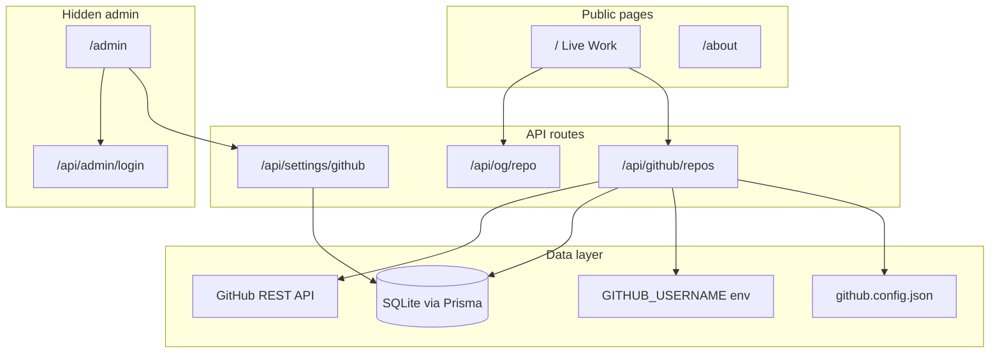

# mitchelturner.dev

[](https://nextjs.org/)
[](https://www.typescriptlang.org/)
[](https://tailwindcss.com/)
[](LICENSE)

Personal portfolio for **[Mitchel Turner](https://github.com/TheMitchyBoy)** — a Next.js site that auto-builds a project showcase from public GitHub repositories, with an about page and a password-protected admin area.

**Live site:** [mitchelturner.dev](https://mitchelturner.dev)

---

## Overview

This repo powers a developer portfolio that stays current without manual updates. Point it at a GitHub username and it:

- Pulls public repositories and ranks them by activity and stars
- Generates a unique **1200×630 cover graphic** per repo (via `next/og`)
- Shows language breakdowns, topics, stars, and deployment links
- Refreshes on a short cache interval (~2 minutes) with an optional force-refresh from admin

The homepage **is** the portfolio. A separate `/about` page covers background and freelance availability. The admin dashboard (`/admin`) is unlisted and password-protected.

---

## Features

| Area | What it does |
|------|----------------|
| **Live Work** (`/`) | Full GitHub portfolio — repo cards with generated art, language bars, deployment badges |
| **About** (`/about`) | Bio, work areas, stack, and contact CTA |
| **OG graphics** (`/api/og/repo`) | On-the-fly cover images from repo metadata |
| **Admin** (`/admin`) | Hidden dashboard — GitHub sync settings, project CRUD, image upload |
| **Auth** | HMAC cookie session; password never stored client-side |

### GitHub integration

- Username resolution: **admin DB** → `GITHUB_USERNAME` env → `github.config.json`
- Deployment links from repo homepage, GitHub Pages, or Deployments API (with token)
- Rate-limit aware: optional `GITHUB_TOKEN` raises limit from 60 → 5,000 req/hr

---

## Architecture



---

## Tech stack

| Layer | Choice |
|-------|--------|
| Framework | [Next.js 16](https://nextjs.org/) (App Router) |
| Language | TypeScript |
| Styling | Tailwind CSS v4 |
| Animation | Framer Motion |
| Database | SQLite + [Prisma](https://www.prisma.io/) |
| Graphics | `next/og` (dynamic PNG) |

---

## Getting started

### Prerequisites

- Node.js 20+
- npm 10+

### Setup

```bash
# Clone and install
git clone https://github.com/TheMitchyBoy/Portfolio.git
cd Portfolio
npm install

# Environment
cp .env.example .env
# Edit ADMIN_PASSWORD (required) and optionally GITHUB_USERNAME / GITHUB_TOKEN

# Database
npx prisma migrate dev

# (Optional) sample showcase projects for admin area
npm run db:seed

# Dev server
npm run dev
```

Open [http://localhost:3000](http://localhost:3000). Admin: [http://localhost:3000/admin](http://localhost:3000/admin) (default password `changeme`).

---

## Configuration

### Environment variables

| Variable | Required | Description |
|----------|----------|-------------|
| `DATABASE_URL` | Yes | SQLite path, e.g. `file:./dev.db` |
| `ADMIN_PASSWORD` | Yes | Password for `/admin` (change before deploy) |
| `GITHUB_USERNAME` | No | GitHub account for Live Work |
| `GITHUB_TOKEN` | No | Read-only token for higher rate limits + deployment status |

### `github.config.json`

Committed fallback when env/DB are unavailable (ideal for serverless):

```json
{
  "username": "your-github-handle"
}
```

---

## Project structure

```
├── github.config.json       # Fallback GitHub username (works on serverless)
├── prisma/
│   ├── schema.prisma        # Project, Vote, Setting models
│   ├── seed.mjs             # Optional sample data
│   └── migrations/
├── public/
│   ├── robots.txt           # Disallows /admin from crawlers
│   └── uploads/             # Admin-uploaded images (gitignored)
└── src/
    ├── app/
    │   ├── page.tsx         # Homepage → Live Work portfolio
    │   ├── about/           # About page
    │   ├── admin/           # Hidden admin dashboard
    │   ├── github/          # Redirects to /
    │   └── api/
    │       ├── github/      # Repo sync + refresh
    │       ├── og/repo/     # Dynamic cover graphics
    │       ├── settings/    # GitHub username config
    │       ├── projects/    # Showcase CRUD + voting (admin-managed)
    │       └── admin/       # Login / session
    ├── components/          # UI (LiveWorkPortfolio, RepoCard, LogoMark, …)
    ├── lib/
    │   ├── github.ts        # GitHub API client + normalization
    │   ├── settings.ts      # Username resolution chain
    │   ├── auth.ts          # Admin session (HMAC cookie)
    │   └── prisma.ts        # DB client singleton
    └── middleware.ts        # noindex headers for /admin
```

---

## Scripts

| Command | Description |
|---------|-------------|
| `npm run dev` | Development server |
| `npm run build` | Prisma generate + production build |
| `npm run start` | Run production build |
| `npm run lint` | ESLint |
| `npm run db:migrate` | Apply Prisma migrations |
| `npm run db:seed` | Seed sample projects |
| `npm run db:reset` | Reset DB and re-seed |

---

## Deployment

**Self-hosted / VPS / Railway / Render** — SQLite + local `public/uploads` work out of the box.

**Serverless (Vercel, etc.)** — SQLite and filesystem uploads are ephemeral. Recommended:

1. Set `GITHUB_USERNAME` in host environment variables
2. Or commit your username in `github.config.json`
3. For admin persistence, use a hosted database (Turso, Postgres) and object storage for uploads

Set `ADMIN_PASSWORD` to a strong secret in production.

---

## License

[MIT](LICENSE) © Mitchel Turner
